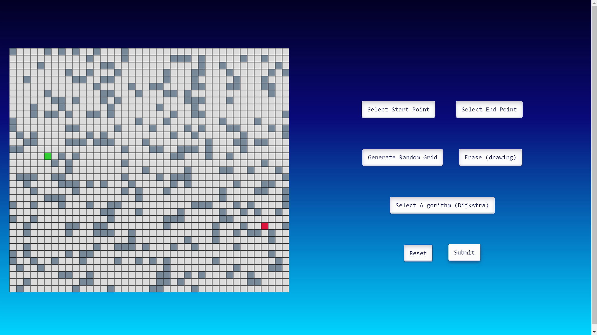
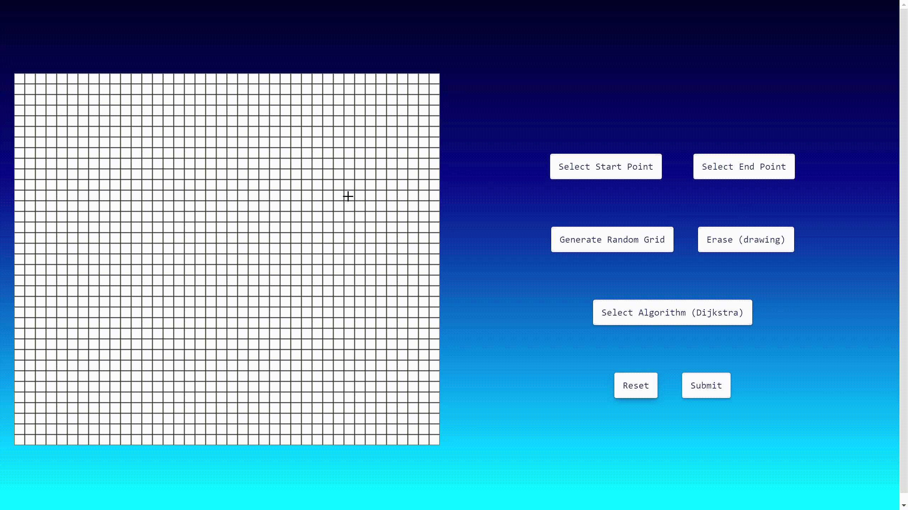

# Real-time Pathfinding Visualization with Django

This Django application provides a real-time visualization of pathfinding algorithms using a grid. It incorporates Dijkstra and A* algorithms to find the shortest path between a start and an end point. The visualization is done in real-time on a web canvas, allowing users to interactively see the algorithm in action.

## Features
- **Dynamic Visualization:** Watch the pathfinding algorithm in action on a grid.
- **Multiple Algorithms:** Choose between Dijkstra and A* algorithms for pathfinding.
- **User Interaction:** Select start and end points, erase walls, and generate random grids.

## Getting Started

1. Clone the repository:
    ```bash
    git clone https://github.com/Shreypatel65/PathVisualization
    cd PathVisualization
    ```

2. Install dependencies:
    ```bash
    pip install -r requirements.txt
    ```

3. Run the Django development server:
    ```bash
    python manage.py runserver
    ```

4. Open your browser and go to http://localhost:8000 to see the real-time pathfinding visualization.

## Usage

1. Click "Select Start Point" or "Select End Point" to choose the start and end points on the grid.
2. Use "Erase" to remove walls or paths.
3. Click "Generate Random Grid" to create a new random grid.
4. Choose the algorithm with "Select Algorithm (Dijkstra/A*)".
5. Click "Submit" to start the selected algorithm and visualize the pathfinding process.

## Screenshots






## Contributing

Contributions are welcome! Fork the repository and create a pull request with your enhancements.